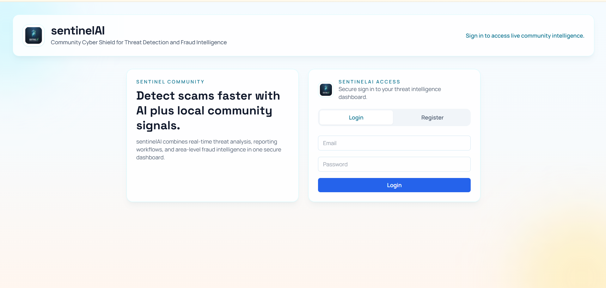
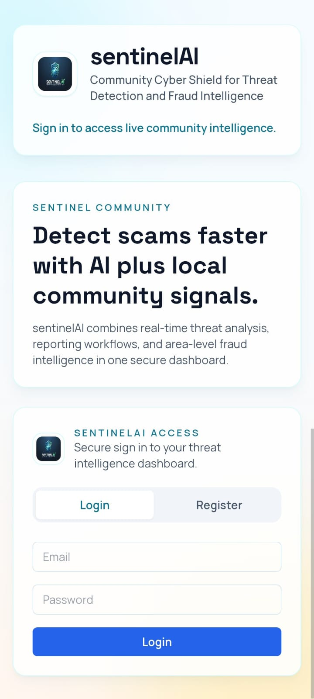

# sentinelAI

sentinelAI is a full-stack cyber safety platform that combines AI threat analysis with community-driven fraud intelligence.

It helps users:
- Analyze suspicious URLs, messages, prompts, and screenshots
- Report confirmed threats to a shared intelligence pool
- See if others encountered the same attack pattern
- View Scams/Frauds Happening In Your Area on a dedicated page

## Live App Links

- Frontend (Public App): https://sentinelai-2.onrender.com
- Backend API Health: https://sentinelai-backend-server.onrender.com/api/health
- AI Service Health: https://sentinelai-1-ehft.onrender.com/health

## App Screenshots

### Desktop View



### Mobile View



## Project Structure

- `Frontend/app` : React + Vite dashboard
- `Backend` : Node.js + Express API + MongoDB
- `Ai-Services` : FastAPI AI analysis service (Gemini-powered)

## Core Features

- Text and URL threat scanner
- Screenshot fake-login detection
- User authentication with JWT
- Threat reporting workflow
- Threat History and Community Intelligence
- Dedicated page for area-level scam/fraud intelligence
- User segment + location-aware aggregation

## Local Development

## 1. Prerequisites

- Node.js 20+
- Python 3.10+
- MongoDB Atlas (or compatible MongoDB)
- Google Gemini API key

## 2. Configure Environment Variables

Copy each example file and fill real values:

- `Backend/.env.example` -> `Backend/.env`
- `Ai-Services/.env.example` -> `Ai-Services/.env`
- `Frontend/app/.env.example` -> `Frontend/app/.env`

### Backend env (`Backend/.env`)

- `PORT=5000`
- `MONGO_URI=...`
- `JWT_SECRET=...`
- `AI_SERVICE_URL=http://127.0.0.1:8000`
- `CORS_ORIGINS=http://localhost:5173,http://127.0.0.1:5173,https://*.onrender.com`

### AI Service env (`Ai-Services/.env`)

- `GEMINI_API_KEY=...`
- `GEMINI_MODEL=gemini-2.5-flash`
- `ALLOWED_ORIGINS=http://localhost:5000`

### Frontend env (`Frontend/app/.env`)

- `VITE_API_URL=http://localhost:5000/api`

## 3. Install Dependencies

### Backend

```bash
cd Backend
npm install
```

### Frontend

```bash
cd Frontend/app
npm install
```

### AI Service

```bash
cd Ai-Services
python -m venv .venv
# Windows
.\.venv\Scripts\activate
pip install -r requirements.txt
```

## 4. Run Services

Run each service in its own terminal.

### AI Service

```bash
cd Ai-Services
.\.venv\Scripts\activate
uvicorn main:app --reload --host 0.0.0.0 --port 8000
```

### Backend

```bash
cd Backend
npm run dev
```

### Frontend

```bash
cd Frontend/app
npm run dev
```

Open `http://localhost:5173`.

## API Health Checks

- Backend: `GET /api/health`
- AI Service: `GET /health` and `GET /ping`

## Deployment Guide (Render + Railway)

Yes, this setup works:
- Frontend on Render (Static Site)
- Backend on Railway (Node service)
- AI Service on Railway (Python service)

Recommended deployment order:
1. AI Service (Railway)
2. Backend API (Railway)
3. Frontend (Render)

## 1) Railway: Deploy AI Service

- Service root directory: `Ai-Services`
- Start command: `uvicorn main:app --host 0.0.0.0 --port $PORT`
- Procfile included: `Ai-Services/Procfile`

Set Railway environment variables:
- `GEMINI_API_KEY`
- `GEMINI_MODEL=gemini-2.5-flash`
- `ALLOWED_ORIGINS=<your-backend-railway-url>`

Health checks:
- `GET /health`
- `GET /ping`

## 2) Railway: Deploy Backend Service

- Service root directory: `Backend`
- Start command: `npm run start`
- Procfile included: `Backend/Procfile`

Set Railway environment variables:
- `PORT=5000` (or Railway default)
- `MONGO_URI=<your-mongodb-uri>`
- `JWT_SECRET=<strong-secret>`
- `AI_SERVICE_URL=<your-ai-railway-url>`
- `CORS_ORIGINS=<your-render-frontend-url>`

Health check:
- `GET /api/health`

## 3) Render: Deploy Frontend Static Site

- Root directory: `Frontend/app`
- Build command: `npm run build`
- Publish directory: `dist`

Set Render environment variables:
- `VITE_API_URL=<your-backend-railway-url>/api`

Important for React Router routes like `/area-intelligence`:
- Add a rewrite rule in Render static site settings:
- Source: `/*`
- Destination: `/index.html`
- Action: `Rewrite`

Without this rewrite, direct URL refresh on `/area-intelligence` can return 404.

## One-Command Local Run (Docker Compose)

Docker support is included for all 3 services.

Files added:
- `docker-compose.yml`
- `Backend/Dockerfile`
- `Ai-Services/Dockerfile`
- `Frontend/app/Dockerfile`

Setup:

1. Copy `.env.compose.example` to `.env` at repo root.
2. Fill required values (`MONGO_URI`, `JWT_SECRET`, `GEMINI_API_KEY`, etc.).
3. Run:

```bash
docker compose up --build
```

Local URLs:
- Frontend: `http://localhost:5173`
- Backend: `http://localhost:5000/api/health`
- AI Service: `http://localhost:8000/health`

## Production Readiness Checklist

- Environment variables configured in all 3 services
- CORS locked to trusted origins only
- MongoDB network access and credentials verified
- Health endpoints responding after deploy
- Login/Register flow working in production
- Threat scan, report, history, community intel, and area intel verified
- Render rewrite rule added for SPA routes (`/* -> /index.html`)

## Frontend Branding

- Project name updated to `sentinelAI`
- Logo source from `Frontend/app/public/logo.png`
- Browser tab icon and page branding updated
- Dedicated route for area intelligence: `/area-intelligence`

## Scripts

### Backend
- `npm run dev`
- `npm run start`

### Frontend
- `npm run dev`
- `npm run build`
- `npm run preview`

### AI Service
- `uvicorn main:app --reload`

